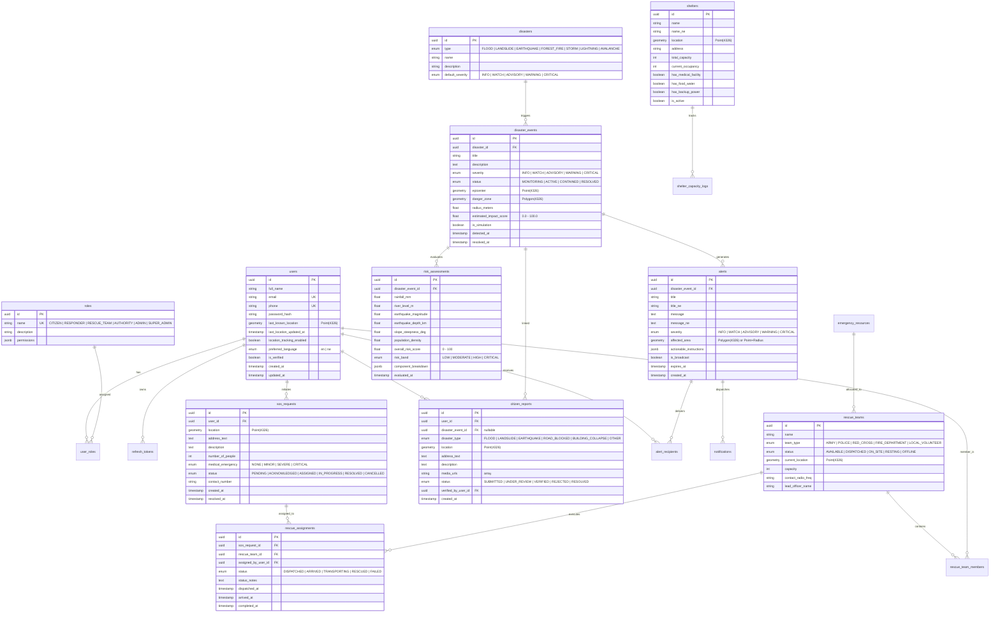

# 🚨 Project SAJAG: Disaster Alert & Emergency Response Platform
## System Architecture & Technical Specification (Phase 1)

> **Platform Name:** **SAJAG (सजग - Alert / Vigilant)**  
> **Target Region:** Nepal (Municipalities, River Basins, Hilly Corridors) & Scalable Globally  
> **Workflow:** `DETECT` → `ANALYZE` → `PREDICT` → `ALERT` → `LOCATE` → `REPORT` → `SOS` → `ASSIGN RESCUE` → `EVACUATE` → `RESOLVE`

---

## 1. High-Level System Architecture

```mermaid
flowchart TB
    subgraph Clients["Client Layer (Frontend)"]
        CitizenUI["📱 Citizen PWA (Mobile/Web)<br/>• Next.js App Router<br/>• Leaflet Map<br/>• SOS Button<br/>• Reports & Alerts"]
        AuthorityUI["🏢 Command Center (Desktop)<br/>• Live Triage Map<br/>• Rescue Team Dispatch<br/>• Risk Analytics<br/>• Simulator Panel"]
        ResponderUI["🚒 First Responder App<br/>• Task Queue<br/>• Navigation to SOS<br/>• Status Updater"]
    end

    subgraph Gateway["API & Communication Gateway"]
        Nginx["Reverse Proxy / SSL / CORS"]
        WSServer["WebSocket / Socket.IO Gateway<br/>(Rooms: admin, authority, disaster:id, user:id)"]
        RESTAPI["NestJS Modular REST API (/api/v1)"]
    end

    subgraph CoreBackend["NestJS Core Business Services"]
        AuthService["Auth & RBAC Service<br/>(JWT + Refresh Rotation)"]
        RiskEngine["Deterministic Risk Engine<br/>• Flood Rule Engine<br/>• Landslide Slope Index<br/>• Earthquake Attenuation"]
        AlertEngine["Alert Engine<br/>• PostGIS Danger Radius<br/>• Geofence Polygon Matching"]
        SOSEngine["SOS & Rescue Orchestrator<br/>• Proximity Dispatch (ST_Distance)<br/>• Status State Machine"]
        AIService["AI Co-Pilot (Advisory Only)<br/>• Report Categorization<br/>• Multi-lingual Summaries (EN/NE)"]
    end

    subgraph AsyncWorker["Background Queue & Async Workers (BullMQ)"]
        RedisQueue[("Redis (Queues, Pub/Sub, Cache)")]
        NotificationWorker["Notification Worker<br/>• Web Push (VAPID)<br/>• SMS Gateway (Mock/NTC)<br/>• Email / In-App"]
        GeofenceWorker["Geofence Audit Worker<br/>• ST_Contains Danger Check"]
        SimulationWorker["Simulation & Scenario Runner<br/>• Flood / Landslide / Quake"]
    end

    subgraph DataStorage["Persistence Layer"]
        Postgres[("Supabase / PostgreSQL 16 + PostGIS<br/>• Spatial GIST Indexes<br/>• Geometry/Geography (EPSG:4326)<br/>• Normalized Relational Tables")]
        RedisCache[("Redis 7<br/>• Rate Limiting<br/>• Socket.IO Adapter<br/>• Transient Geo Coordinates")]
        Storage[("Object Storage (Supabase/S3)<br/>• Report Photos<br/>• Incident Evidence")]
    end

    subgraph ExternalData["External Ingestion Feeds"]
        DHM["Hydrology & Met Stations<br/>(DHM Nepal / River Gauges)"]
        USGS["Earthquake Feeds (USGS / NSC Nepal)"]
        WeatherAPI["Open-Meteo / Rainfall Forecasts"]
    end

    Clients <-->|HTTPS / REST| RESTAPI
    Clients <-->|WSS (Socket.IO)| WSServer
    RESTAPI --> AuthService
    RESTAPI --> RiskEngine
    RESTAPI --> AlertEngine
    RESTAPI --> SOSEngine
    RESTAPI --> AIService

    WSServer <--> RedisCache
    CoreBackend --> RedisQueue
    RedisQueue --> NotificationWorker
    RedisQueue --> GeofenceWorker
    RedisQueue --> SimulationWorker

    CoreBackend --> Postgres
    NotificationWorker --> Clients
    ExternalData --> RiskEngine
```

---

## 2. Database ERD & Data Model (PostgreSQL + PostGIS)

All spatial entities use `GEOMETRY(Point, 4326)` or `GEOMETRY(Polygon, 4326)` with dedicated spatial **GIST** indexes for sub-millisecond geographic range queries.



---

## 3. PostGIS Spatial Operations & Core Queries

1. **Find all citizens inside active Disaster Danger Zone ($5\text{km}$ radius or polygon)**:
   ```sql
   SELECT u.id, u.full_name, u.phone, u.preferred_language,
          ST_Distance(u.last_known_location::geography, de.epicenter::geography) AS distance_meters
   FROM users u
   JOIN disaster_events de ON de.id = $1
   WHERE u.location_tracking_enabled = true
     AND ST_DWithin(u.last_known_location::geography, de.epicenter::geography, de.radius_meters)
   ORDER BY distance_meters ASC;
   ```

2. **Find Nearest Safe Shelter with Capacity**:
   ```sql
   SELECT s.id, s.name, s.address, s.total_capacity, s.current_occupancy,
          (s.total_capacity - s.current_occupancy) AS available_beds,
          ST_Distance(s.location::geography, ST_SetSRID(ST_MakePoint($1, $2), 4326)::geography) AS distance_meters
   FROM shelters s
   WHERE s.is_active = true
     AND (s.total_capacity - s.current_occupancy) > 0
   ORDER BY distance_meters ASC
   LIMIT 3;
   ```

3. **Find Nearest Available Rescue Teams to an SOS Incident**:
   ```sql
   SELECT rt.id, rt.name, rt.team_type, rt.lead_officer_name,
          ST_Distance(rt.current_location::geography, sos.location::geography) AS distance_meters
   FROM rescue_teams rt, sos_requests sos
   WHERE sos.id = $1
     AND rt.status = 'AVAILABLE'
   ORDER BY distance_meters ASC
   LIMIT 5;
   ```

---

## 4. Disaster & Risk Scoring Engine

The Risk Engine is a clean, decoupled service:
$$\text{RiskScore} = \min\left(100, \sum_{i} w_i \cdot S_i\right)$$

| Disaster Type | Deterministic Factors | Weight | Formula / Rules |
|---|---|---|---|
| **Flood** | 1. 24h Rain Gauge<br/>2. River Level vs Danger Mark<br/>3. Soil Saturation / Forecast<br/>4. Verified Citizen Reports | $0.35$<br/>$0.40$<br/>$0.15$<br/>$0.10$ | • River > Danger Threshold $\rightarrow S_{river} = 100$<br/>• Rain > 120mm/day $\rightarrow S_{rain} = 90$<br/>• Reports $\ge 5$ in $3\text{km} \rightarrow S_{rep} = 85$ |
| **Landslide** | 1. 72h Cumulative Rain<br/>2. Slope Angle ($>30^\circ$ high risk)<br/>3. Historical Susceptibility Index<br/>4. Blocked Road Reports | $0.40$<br/>$0.25$<br/>$0.20$<br/>$0.15$ | • High steepness + saturated soil $\rightarrow$ High alert<br/>• Mugling/Narayanghat corridor historical tags |
| **Earthquake** | 1. Magnitude ($M_w$)<br/>2. Focal Depth ($km$)<br/>3. Population density in radius | $0.50$<br/>$0.30$<br/>$0.20$ | Attenuation: $R_{danger} = 10^{(0.5 M_w - 1.2)}$ km.<br/>$M_w \ge 6.5 \rightarrow$ CRITICAL Immediate Broadcast |

### Normalized Risk Bands:
* `0 - 30`: **LOW** (Monitoring mode, Green badge)
* `31 - 50`: **MODERATE** (Advisory, Yellow badge)
* `51 - 75`: **HIGH** (Warning, Orange badge, standby rescue teams)
* `76 - 100`: **CRITICAL** (Emergency Warning, Red blinking, auto-push to radius, siren audio in PWA)

---

## 5. Granular RBAC Permissions Matrix

| Permission Key | CITIZEN | RESPONDER | RESCUE_TEAM | AUTHORITY | ADMIN / SUPER_ADMIN |
|---|:---:|:---:|:---:|:---:|:---:|
| `disaster:read` | ✅ | ✅ | ✅ | ✅ | ✅ |
| `disaster:create` / `update` | ❌ | ❌ | ❌ | ✅ | ✅ |
| `alert:read` | ✅ | ✅ | ✅ | ✅ | ✅ |
| `alert:create` / `broadcast` | ❌ | ❌ | ❌ | ✅ | ✅ |
| `sos:create` (Send SOS) | ✅ | ✅ | ✅ | ✅ | ✅ |
| `sos:read_own` | ✅ | ✅ | ✅ | ✅ | ✅ |
| `sos:read_all` | ❌ | ✅ | ✅ | ✅ | ✅ |
| `sos:assign` (Dispatch) | ❌ | ❌ | ❌ | ✅ | ✅ |
| `sos:update_status` | ❌ | ✅ | ✅ | ✅ | ✅ |
| `report:create` | ✅ | ✅ | ✅ | ✅ | ✅ |
| `report:verify` | ❌ | ❌ | ❌ | ✅ | ✅ |
| `rescue:update_location` | ❌ | ❌ | ✅ | ✅ | ✅ |
| `simulation:trigger` | ❌ | ❌ | ❌ | ✅ (Demo) | ✅ |
| `user:manage` | ❌ | ❌ | ❌ | ❌ | ✅ |

---

## 6. Monorepo / Directory Layout

```text
sajag_project/
├── backend/                       # NestJS API & WebSocket Service
│   ├── src/
│   │   ├── modules/
│   │   │   ├── auth/              # JWT, Refresh Tokens, RBAC Guards, Strategies
│   │   │   ├── users/             # Profile, Last Known Location, Preferences
│   │   │   ├── disasters/         # Events, Types, Epicenters, Danger Polygons
│   │   │   ├── risk/              # RiskEngine, Multi-hazard formulas, Thresholds
│   │   │   ├── alerts/            # Alert creation, Geo-targeting, PostGIS checks
│   │   │   ├── sos/               # SOS creation, Triage, Distance queries
│   │   │   ├── rescue/            # Teams, assignments, live tracking
│   │   │   ├── reports/           # Citizen incident reports, verification, media
│   │   │   ├── shelters/          # Capacity management, safe haven finder
│   │   │   ├── notifications/     # WebPush, SMS mock, Email, BullMQ worker
│   │   │   ├── weather/           # DHM river levels, rainfall ingestion & feeds
│   │   │   ├── simulation/        # Hackathon Demo simulator (Flood, Quake, Landslide)
│   │   │   ├── ai/                # Advisory report categorization & multilingual summaries
│   │   │   └── health/            # Health, readiness, liveness probes
│   │   ├── common/
│   │   │   ├── decorators/        # @CurrentUser(), @Roles(), @Permissions()
│   │   │   ├── guards/            # JwtAuthGuard, RolesGuard, PermissionsGuard
│   │   │   ├── filters/           # GlobalExceptionFilter
│   │   │   ├── interceptors/      # ResponseTransformInterceptor, LoggingInterceptor
│   │   │   └── pipes/             # ZodValidationPipe
│   │   ├── database/              # Prisma / Kysely PostGIS connection & migrations
│   │   ├── websocket/             # EventsGateway, Rooms, Presence
│   │   └── main.ts
│   ├── prisma/
│   │   ├── schema.prisma          # PostGIS models & mappings
│   │   └── seed.ts                # Nepal demo data (Kathmandu, Pokhara, Chitwan, etc.)
│   ├── package.json
│   └── tsconfig.json
│
├── frontend/                      # Next.js 14+ App Router Client
│   ├── app/
│   │   ├── (public)/              # Landing page, public alerts feed, safety tips
│   │   │   ├── page.tsx
│   │   │   ├── alerts/
│   │   │   └── shelters/
│   │   ├── (auth)/                # Clean login, register, role selector
│   │   │   ├── login/
│   │   │   └── register/
│   │   ├── citizen/               # Mobile-first Citizen Dashboard
│   │   │   ├── page.tsx           # Risk gauge, Near me, 1-tap SOS, Quick report
│   │   │   ├── sos/               # Active SOS live tracker
│   │   │   └── report/            # Photo upload + GPS report form
│   │   ├── authority/             # Command Center Dashboard (Desktop optimized)
│   │   │   ├── page.tsx           # High-density Command Center (Metrics + Map + Triage)
│   │   │   ├── alerts/            # Broadcast center
│   │   │   ├── rescue/            # Team dispatch grid
│   │   │   └── simulation/        # Hackathon 1-Click Disaster Simulator panel
│   │   ├── responder/             # Responder view (active assignments, victims)
│   │   ├── layout.tsx
│   │   └── globals.css
│   ├── components/
│   │   ├── ui/                    # shadcn/ui components (button, dialog, badge, tabs)
│   │   ├── map/                   # Leaflet Map, Cluster, Danger Zone overlays, Shelters
│   │   ├── sos/                   # SOS Button (with countdown confirmation), Active status
│   │   ├── alerts/                # Alert banner, Emergency siren audio player
│   │   └── simulation/            # Judge demo controls modal
│   ├── stores/
│   │   ├── auth.store.ts          # User, role, tokens, session state
│   │   ├── map.store.ts           # Zoom, center, active layers, selected incident
│   │   ├── sos.store.ts           # Client SOS status & countdown
│   │   └── ui.store.ts            # Sidebar, theme, language (en/ne)
│   ├── lib/
│   │   ├── api.ts                 # Axios instance with refresh token interceptor
│   │   ├── socket.ts              # Socket.IO client instance & event listeners
│   │   └── i18n/                  # Bilingual strings (Nepali & English)
│   ├── package.json
│   └── tsconfig.json
│
├── docker-compose.yml             # Postgres + PostGIS, Redis, Backend, Frontend
├── .env.example
└── README.md
```

---

## 7. Standardized API Design

Every API response follows a consistent envelope:
```json
{
  "success": true,
  "data": {},
  "message": "Operation completed successfully",
  "meta": {
    "timestamp": "2026-09-06T08:45:00Z",
    "requestId": "req_1082ab3c",
    "pagination": { "page": 1, "limit": 20, "total": 85 }
  }
}
```

### Core API Endpoints:
* `POST /api/v1/auth/register` & `POST /api/v1/auth/login` & `POST /api/v1/auth/refresh`
* `GET /api/v1/disasters` & `POST /api/v1/disasters` (Authority/Admin)
* `GET /api/v1/alerts/active` & `POST /api/v1/alerts/broadcast` (Authority)
* `POST /api/v1/sos` (Citizen creates SOS with GPS)
* `GET /api/v1/sos/active` (Authority live SOS triage queue)
* `PATCH /api/v1/sos/:id/status` (Assign, acknowledge, resolve)
* `POST /api/v1/rescue/assign` (Dispatch team to SOS)
* `GET /api/v1/shelters/nearest?lat=27.7172&lng=85.3240` (PostGIS radius query)
* `POST /api/v1/reports` (Citizen report with photo URL and coordinates)
* `POST /api/v1/simulation/trigger` (Demo endpoint: Flood, Earthquake, Landslide)

### Real-Time Socket.IO Taxonomy:
* `sos:created` $\rightarrow$ Broadcast to `authority-room`
* `sos:updated` $\rightarrow$ Broadcast to `authority-room` & `user:{citizenId}`
* `alert:broadcast` $\rightarrow$ Broadcast to all connected clients / `region:{id}`
* `rescue:location_updated` $\rightarrow$ Broadcast to `authority-room` & assigned victim

---

## 8. Hackathon 1-Click Simulation Engine

Judges must see the end-to-end pipeline in seconds without waiting for an actual disaster:

1. **🌊 "SIMULATE FLOOD" (Bagmati Basin, Kathmandu)**
   - Simulates rainfall $>160\text{mm}$ and River Level $+4.2\text{m}$ at Balkhu gauge.
   - Triggers `RiskEngine` $\rightarrow$ Score $88/100$ (CRITICAL).
   - Generates Geofenced Red Danger Zone polygon across Balkhu/Teku.
   - Automatically identifies 3 demo citizens in the zone and pushes audio siren alert.
   - Spawns an automated citizen SOS $\rightarrow$ Alerts Authority Dashboard.
   - Suggests nearest evacuation shelter: *Balkhu Community Center*.

2. **⛰️ "SIMULATE LANDSLIDE" (Prithvi Highway, Mugling-Kurintar)**
   - Simulates 72h continuous torrential rain on a $38^\circ$ slope.
   - Risk score $78/100$ $\rightarrow$ HIGH RISK alert generated.
   - Highway corridor geofenced; warns approaching vehicles to divert.

3. **🌎 "SIMULATE EARTHQUAKE" (M6.7 epicentered near Melamchi)**
   - Depth $10\text{km}$; calculates attenuation radius of $48\text{km}$.
   - Broadcasts immediate Earthquake Warning across Kathmandu Valley.
   - Highlights Kathmandu/Lalitpur/Bhaktapur emergency open spaces.

---

## 9. Phased Implementation Roadmap

* **Phase 1 (Current):** Architectural blueprint, schema ERD, API specs, folder structure, and design sign-off.
* **Phase 2 — Foundation:** Docker-compose (PostGIS 16 + Redis 7), NestJS backend initialization, Prisma schema with PostGIS types, JWT + RBAC guards, Next.js frontend setup with Tailwind + shadcn/ui.
* **Phase 3 — Core Disaster & Map:** Risk engine algorithms, PostGIS spatial queries (danger radius & inside-zone checks), Leaflet interactive live map with risk layers.
* **Phase 4 — Emergency Response & SOS:** Citizen 1-tap SOS flow, Authority SOS triage queue, Rescue team dispatch logic, Nearest shelter finder with evacuation instructions.
* **Phase 5 — Real-time & Queue:** Socket.IO rooms and bidirectional events, BullMQ notification worker pipeline.
* **Phase 6 — AI Co-Pilot:** Report categorization and English/Nepali bilingual emergency alert summarization.
* **Phase 7 — Demo Suite & Polish:** 1-Click Hackathon simulation panel, rich Nepal seed data (Kathmandu, Pokhara, Chitwan), and end-to-end verification.
